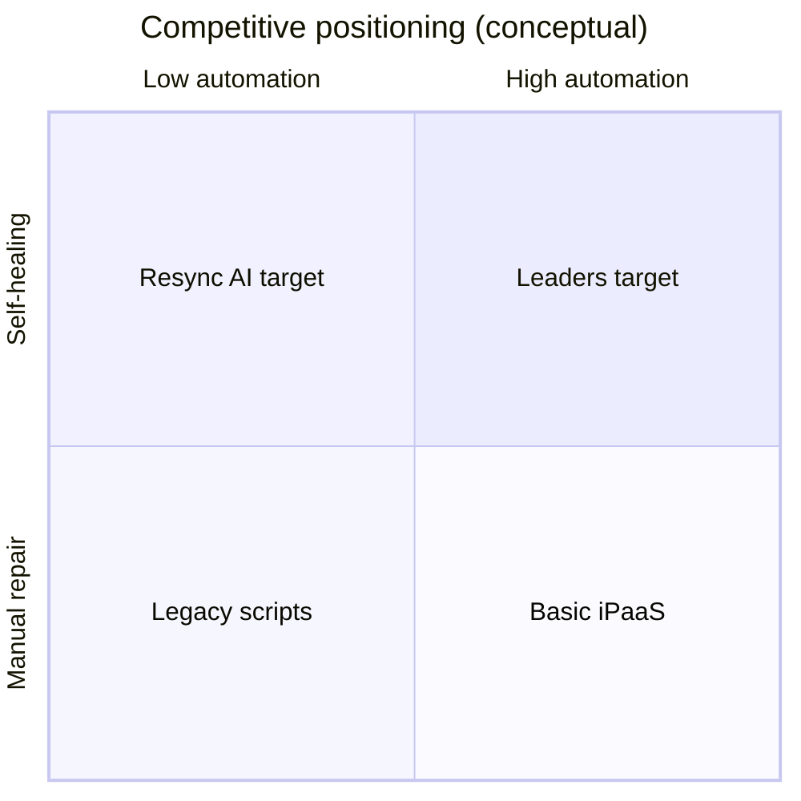

# Business models in workflow, iPaaS & AI ops (today’s industry)

## Where Resync AI sits

Resync combines **visual workflow building** (n8n/Zapier lane) with **AI-assisted runtime repair** (emerging ops/observability lane) and **code export** (developer platforms lane).

## Models used in the industry (2025–2026)

| Model | Examples | Resync application |
|-------|----------|-------------------|
| **Subscription SaaS** | Monthly tiers | Community / Builder / Pro / Enterprise |
| **Usage / credits** | API meters | Self-heal credits per org |
| **Freemium + community** | Templates, gallery | Free tier + template reuse |
| **Land & expand** | Team seats, roles | Org members + RBAC |
| **Platform / marketplace** | Template revenue share | 20% take rate (10%+10%); Enterprise 12% |
| **Services attach** | Implementation partners | Enterprise onboarding packages |

## Revenue streams (Resync stack)

1. **Recurring subscriptions** (Stripe) — primary  
2. **Overage credits** — secondary from year 2  
3. **Enterprise contracts** — annual, custom SLAs  
4. **Marketplace take rate** — phase 3 (15–20% on template sales)  
5. **Certification / training** — phase 4  

## Comparable category benchmarks (illustrative)

| Metric | Typical B2B SaaS | Resync target (steady state) |
|--------|------------------|------------------------------|
| Gross margin | 75–85% | 80%+ (API costs managed) |
| NRR | 100–120% | 110%+ |
| CAC payback | 12–18 mo | < 14 mo on Pro |
| Logo churn (annual) | 5–10% | < 8% with community lock-in |

## Go-to-market motions

- **Product-led growth:** free builder + templates → upgrade at credit limit  
- **Community-led:** waitlist, spotlights, co-marketing with nonprofits/commerce  
- **Founder-led sales:** Enterprise from network  

## Pricing alignment

See `resync-ai/lib/billing/tiers.ts` — product and legal/commercial docs must stay synchronized on tier names and credit limits.
