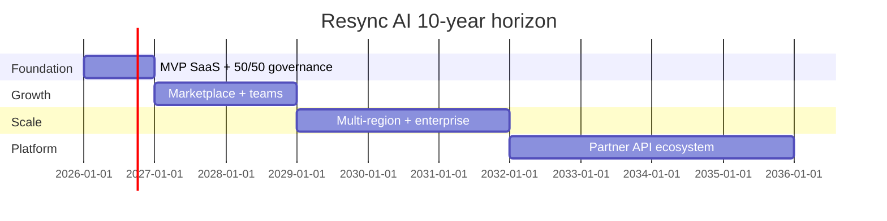

# Ten-year scalability roadmap

Ensures Resync AI is **not a dead-end product**—phased growth with clear engineering and commercial milestones.

## Timeline overview

## Phase 1 (Years 0–2): Foundation & PMF

**Product:** Builder, runtime heal, Stripe, templates, community, PWA  
**Scale:** Single region, Supabase + Vercel  
**Revenue:** Freemium → Starter/Pro  
**Team:** Founders + 1–2 contractors  
**Goal:** 500+ paying orgs, NRR > 100%  

## Phase 2 (Years 2–4): Community marketplace

- Paid template marketplace + **revenue share** for authors  
- Real-time collaboration on canvas  
- SOC 2 Type I → Type II  
- Salesforce/HubSpot connector pack  

## Phase 3 (Years 4–6): Enterprise & compliance

- SSO (SAML), SCIM, VPC / private runtime workers  
- On-prem export + air-gapped heal agents  
- Dedicated success for Enterprise  
- **ARR target band:** $6M–$15M (scenario-dependent)  

## Phase 4 (Years 6–8): Platform API

- Public **Resync Runtime API** for ISVs  
- OEM white-label for agencies  
- Usage-based billing at scale (Stripe metered + custom contracts)  

## Phase 5 (Years 8–10): Category leadership

- Industry-specific template packs (health, education, commerce)  
- M&A of complementary tools (optional, unanimous partner approval)  
- Global trademark portfolio maintenance  
- **ARR target band:** $20M–$50M+ with 20%+ operating margin  

## Infrastructure scalability

| Stage | Users | Architecture |
|-------|-------|--------------|
| 0–10k MAU | Monolith Next + Supabase |
| 10k–100k | Read replicas, queue workers, Redis rate limits |
| 100k+ | Regional deploy, runtime isolation per tenant tier |

## Profitability inflection

- **Break-even:** target between Y2–Y3 in base case (doc 07)  
- Reinvest **≥ 40%** of profit Years 2–4 into R&D (unanimous approval)  

## Partner governance at scale

At > $5M ARR, consider **independent board observer**; founders retain 50/50 unless both agree to dilute for funding.
