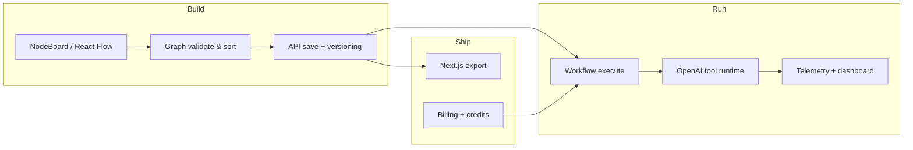

# Developer overview, process modules & workflow

Technical companion for Daniel Noel Mcgarry and Brooke Caroline Hunt (and engineering hires).

## System workflow (end-to-end)

## Codebase modules (`resync-ai/`)

| Module | Path | Responsibility |
|--------|------|----------------|
| Marketing & retention | `app/page.tsx`, `community`, `templates` | PLG + community |
| Auth & middleware | `middleware.ts`, `(auth)/` | Session gate |
| Builder | `components/builder/*` | Canvas UX |
| Graph logic | `workers/nodeGraphLogic.ts` | Cycle detect, topo sort |
| Runtime | `lib/runtime/*`, `api/runtime/execute` | Self-healing |
| Billing | `lib/billing/*`, Stripe routes | Revenue |
| Offline | `public/sw.js`, `lib/offline/*` | PWA retention |
| Codegen | `lib/codegen/generateNextjs.ts` | Export moat |

## SDLC & quality gates

| Gate | Command / action |
|------|------------------|
| Type safety | `npm run typecheck` |
| Unit tests | `npm test` (graph + runtime) |
| E2E smoke | `npm run test:e2e` |
| CI | `.github/workflows/ci.yml` |
| DB migrations | Supabase migration review (both founders for breaking changes) |
| Security | RLS review on every schema change |

## Release process (indexed)

1. Feature branch `cursor/*` or `feat/*`  
2. PR with tests green  
3. Staging deploy + manual heal smoke test  
4. Production deploy; monitor `/api/health`  
5. Post-release note in partner Slack + update roadmap doc  

## Scalability hooks (pre-built for 10-year plan)

- Credit counters → future metered Stripe  
- Workflow versions → marketplace versioning  
- Telemetry tables → enterprise analytics SKU  
- Export pipeline → OEM / on-prem bundles  

Full build spec: [../RESYNC_AI_MASTER_DEPLOYMENT_BLUEPRINT.md](../RESYNC_AI_MASTER_DEPLOYMENT_BLUEPRINT.md)
