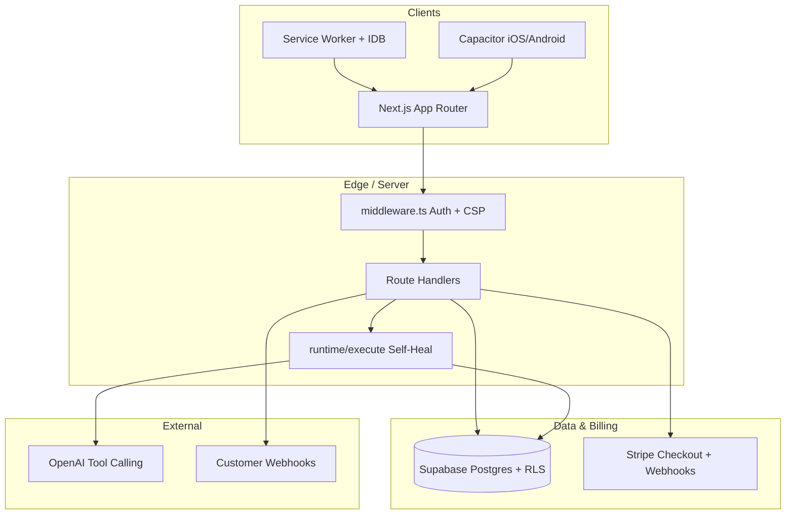

# Resync AI — Master Deployment Prompt & Blueprint (Cursor IDE)

**Version:** 2.0  
**Purpose:** Single source of truth for a production-grade, full-stack build of **Resync AI** — self-healing workflow execution, visual builder, codegen, billing, and cross-platform delivery.  
**How to use:** Paste the [System Instruction](#system-instruction-for-cursor-ide-copy-paste) into a new Cursor Agent chat, or point the agent at this file with: *“Execute the build order in `docs/RESYNC_AI_MASTER_DEPLOYMENT_BLUEPRINT.md`.”*

---

## What Changed vs. the Original Plan (Enhancement Summary)

| Area | Original gap | Enhancement |
|------|----------------|-------------|
| **Identity & access** | RLS only | Supabase Auth (email/OAuth), session middleware, org invites, role matrix |
| **Data model** | 5 tables | Versioned workflows, execution runs, API keys, usage quotas, audit log |
| **Runtime** | GPT-4o tools only | Zod validation, retry/backoff, circuit breaker, idempotent webhooks, tier quotas |
| **Builder** | Worker + canvas | Typed node registry, React Flow (or equivalent), undo/redo, autosave |
| **Codegen** | 3 outputs | Plus OpenAPI snippet, env template, and deployment README per export |
| **Observability** | Telemetry table | Structured logs, `/api/health`, Sentry optional hook, dashboard aggregates |
| **Security** | Implicit | CSP headers, rate limits, webhook replay protection, secrets never in client |
| **Quality** | None specified | Vitest + Playwright gates, CI workflow, definition-of-done per module |
| **Deploy** | Scorecard only | Vercel + Supabase + Stripe checklist, migration order, rollback notes |
| **DX** | Minimal tree | Expanded tree, shared `types/`, `schemas/`, hooks, and `.cursorrules` |

---

## Product Definition

**Resync AI** is a B2B SaaS that:

1. Lets teams design **workflow graphs** (nodes = HTTP steps, transforms, conditions, AI repair steps).
2. **Executes** workflows against real endpoints; on failure, invokes **self-healing** (schema patch + fallback routes) via LLM tool calling under policy limits.
3. **Exports** runnable Next.js artifacts (API routes + hooks + UI runner).
4. Bills via **Stripe** tiers with **metered API credits** stored in Postgres.
5. Ships as **PWA** and optional **Capacitor** shells with offline edit queue.

---

## Architecture (Target)



**Stack (canonical):**

- **Framework:** Next.js 14+ App Router, React 18+, strict TypeScript  
- **UI:** Tailwind CSS, shadcn/ui-compatible patterns (Radix primitives optional)  
- **Graph UI:** `@xyflow/react` (React Flow) recommended for connectors, minimap, accessibility  
- **DB:** Supabase (PostgreSQL, Auth, RLS, optional Realtime for live console)  
- **Payments:** Stripe Checkout, Customer Portal, signed webhooks  
- **AI:** OpenAI (`gpt-4o` primary; env-configurable fallback model)  
- **Offline:** `idb` + custom `sw.js` (document strategies below)  
- **Mobile:** Capacitor 6+ with Haptics, Preferences, Push (stub listeners OK if no FCM keys)  
- **Workers:** `nodeGraphWorker.ts` compiled/bundled for browser (prefer TS over raw `.js`)

---

## Non-Negotiable Execution Rules (Agent)

1. **No mocks in production paths** — Every route, component, and lib function must be fully implemented. Test doubles only in `*.test.ts` / `e2e/`.
2. **Strict TypeScript** — `strict: true`, no `any` except isolated third-party shims with comments.
3. **Validate at boundaries** — Zod schemas for all API bodies, Stripe metadata, and workflow node payloads.
4. **Multi-tenant isolation** — Every query scoped by `organization_id`; RLS must pass negative tests (user A cannot read org B).
5. **Secrets** — Server-only env vars; never expose `SUPABASE_SERVICE_ROLE_KEY`, `STRIPE_SECRET_KEY`, or `OPENAI_API_KEY` to the client.
6. **Idempotency** — Stripe webhooks and offline sync use idempotency keys / processed-event table.
7. **Accessibility** — Builder usable via keyboard; respect `prefers-reduced-motion` (disable or simplify WebGL).
8. **Commit discipline** — One module per commit message prefix: `feat(db):`, `feat(runtime):`, etc.

---

## Environment Variable Matrix

| Variable | Where | Required | Purpose |
|----------|--------|----------|---------|
| `NEXT_PUBLIC_SUPABASE_URL` | Client | Yes | Supabase project URL |
| `NEXT_PUBLIC_SUPABASE_ANON_KEY` | Client | Yes | Anon key (RLS enforced) |
| `SUPABASE_SERVICE_ROLE_KEY` | Server only | Yes | Webhooks, admin provisioning |
| `DATABASE_URL` | Server/Migrate | Optional | Direct Postgres if not using Supabase CLI |
| `OPENAI_API_KEY` | Server only | Yes | Self-healing runtime |
| `OPENAI_MODEL` | Server | No | Default `gpt-4o` |
| `STRIPE_SECRET_KEY` | Server only | Yes | Checkout + Portal |
| `STRIPE_WEBHOOK_SECRET` | Server only | Yes | Webhook verification |
| `NEXT_PUBLIC_STRIPE_PUBLISHABLE_KEY` | Client | Yes | Checkout redirect |
| `STRIPE_PRICE_STARTER` / `_PRO` / `_ENTERPRISE` | Server | Yes | Price IDs |
| `NEXT_PUBLIC_APP_URL` | Both | Yes | OAuth redirects, Stripe success URLs |
| `RESYNC_ENCRYPTION_KEY` | Server | Prod | Encrypt stored customer webhook secrets (32-byte base64) |
| `UPSTASH_REDIS_REST_URL` | Server | Prod | Rate limiting (optional: in-memory dev) |
| `UPSTASH_REDIS_REST_TOKEN` | Server | Prod | Rate limiting |
| `SENTRY_DSN` | Server | No | Error tracking |

Provide `.env.example` (committed) and `.env.local` (gitignored).

---

## Project File Directory Tree (Complete Target)

Create every path below with full implementations:

```text
resync-ai/
├── .env.example
├── .env.local                    # gitignored — agent creates locally only
├── .cursorrules
├── .github/
│   └── workflows/
│       └── ci.yml
├── capacitor.config.ts
├── next.config.mjs
├── package.json
├── tailwind.config.ts
├── tsconfig.json
├── vitest.config.ts
├── playwright.config.ts
├── public/
│   ├── favicon.ico
│   ├── manifest.json
│   ├── sw.js
│   ├── icons/                    # PWA 192/512
│   └── shaders/
│       └── background.frag
├── supabase/
│   ├── config.toml                 # optional local dev
│   └── migrations/
│       ├── 20260805000000_init_schema.sql
│       └── 20260805000001_rls_and_functions.sql
├── app/
│   ├── layout.tsx
│   ├── page.tsx
│   ├── globals.css
│   ├── (auth)/
│   │   ├── login/page.tsx
│   │   └── callback/route.ts       # Supabase OAuth code exchange
│   ├── pricing/page.tsx
│   ├── dashboard/page.tsx
│   ├── builder/
│   │   └── page.tsx                # auth-gated
│   └── api/
│       ├── health/route.ts
│       ├── stripe/
│       │   ├── checkout/route.ts
│       │   ├── portal/route.ts
│       │   └── webhook/route.ts
│       ├── runtime/
│       │   └── execute/route.ts
│       ├── telemetry/
│       │   └── log/route.ts
│       ├── webhooks/
│       │   └── dispatch/route.ts
│       └── workflows/
│           ├── save/route.ts
│           ├── list/route.ts
│           └── [id]/execute/route.ts
├── components/
│   ├── ui/
│   │   ├── Header.tsx
│   │   ├── Footer.tsx
│   │   ├── WebGLCanvas.tsx
│   │   ├── PricingTable.tsx
│   │   └── ReducedMotionFallback.tsx
│   ├── builder/
│   │   ├── NodeBoard.tsx
│   │   ├── NodeCard.tsx
│   │   ├── ConsoleOutput.tsx
│   │   ├── CodeExportModal.tsx
│   │   └── nodeTypes.ts
│   └── dashboard/
│       ├── MetricsGrid.tsx
│       └── TelemetryTable.tsx
├── hooks/
│   ├── useWorkflow.ts
│   ├── useOrganization.ts
│   └── useOfflineQueue.ts
├── lib/
│   ├── supabase/
│   │   ├── client.ts
│   │   ├── server.ts
│   │   └── middleware.ts
│   ├── auth/
│   │   └── roles.ts
│   ├── billing/
│   │   ├── tiers.ts
│   │   └── credits.ts
│   ├── runtime/
│   │   ├── selfHeal.ts
│   │   ├── openaiTools.ts
│   │   └── circuitBreaker.ts
│   ├── offline/
│   │   └── idbStorage.ts
│   ├── mobile/
│   │   └── nativePlugins.ts
│   ├── codegen/
│   │   └── generateNextjs.ts
│   ├── sdk/
│   │   └── ResyncNodeSDK.ts
│   ├── logger.ts
│   └── rateLimit.ts
├── schemas/
│   ├── workflow.ts
│   ├── runtime.ts
│   └── stripe.ts
├── types/
│   └── database.ts                 # generated or hand-maintained Database type
├── workers/
│   └── nodeGraphWorker.ts
├── tests/
│   ├── unit/
│   │   ├── graphWorker.test.ts
│   │   └── selfHeal.test.ts
│   └── e2e/
│       └── smoke.spec.ts
└── middleware.ts
```

---

## Module Specifications (Enhanced)

### MODULE 1: Database Schema, Auth & Multi-Tenant RLS

**Files:** `supabase/migrations/*.sql`, `types/database.ts`

**Enums:**

- `user_role`: `OWNER`, `ADMIN`, `BUILDER`, `VIEWER`
- `subscription_tier`: `FREE`, `STARTER`, `PRO`, `ENTERPRISE`
- `execution_status`: `SUCCESS`, `FAILED`, `SELF_HEALED`, `FALLBACK_TRIGGERED`, `QUOTA_EXCEEDED`, `TIMEOUT`

**Core tables:**

| Table | Purpose |
|-------|---------|
| `profiles` | `id` → auth.users, display_name, avatar_url |
| `organizations` | slug, name, settings jsonb |
| `organization_members` | org_id, user_id, role |
| `subscriptions` | stripe_customer_id, stripe_subscription_id, tier, status, current_period_end |
| `api_usage_counters` | org_id, period_start, credits_used, credits_limit |
| `workflows` | org_id, name, slug, active_version_id |
| `workflow_versions` | workflow_id, version, graph jsonb, created_by |
| `workflow_executions` | org_id, workflow_id, status, input/output jsonb, duration_ms, healed boolean |
| `workflow_telemetry` | execution_id, step_id, level, message, payload jsonb |
| `stripe_webhook_events` | event_id unique, processed_at — idempotency |
| `audit_logs` | org_id, actor_id, action, resource_type, resource_id, metadata |

**Functions & RLS:**

- `get_user_org_ids()` → setof uuid
- `user_org_role(org_id)` → user_role
- Policies: SELECT/INSERT/UPDATE/DELETE per table using role matrix (VIEWER read-only, BUILDER can edit workflows, ADMIN billing, OWNER all).

**Indexes:** `(organization_id)`, `(workflow_id, version desc)`, `(stripe_subscription_id)`, GIN on `graph` if querying node types.

**Acceptance gate:** SQL migration applies cleanly; RLS test script or documented manual steps prove cross-org denial.

---

### MODULE 2: WebGL / Shader Background (Performance & A11y)

**File:** `components/ui/WebGLCanvas.tsx`, `public/shaders/background.frag`, `ReducedMotionFallback.tsx`

**Requirements:**

- `requestAnimationFrame` loop; cap DPR on mobile (`Math.min(devicePixelRatio, 2)`).
- Pause rendering when tab hidden (`document.visibilityState`).
- Static gradient fallback when WebGL unavailable or `prefers-reduced-motion: reduce`.
- ResizeObserver for canvas sizing; cleanup all listeners on unmount.
- No synchronous heavy work in render path; shader compile once.

**Acceptance gate:** Lighthouse performance ≥ 90 on marketing page (desktop); no main-thread long tasks > 200ms from canvas.

---

### MODULE 3: Self-Healing Runtime (LLM Tool Calling)

**Files:** `app/api/runtime/execute/route.ts`, `lib/runtime/*`, `schemas/runtime.ts`

**Request body (Zod):**

```typescript
{
  organizationId: string;
  workflowExecutionId?: string;
  failedEndpoint: string;
  errorMessage: string;
  expectedOutputSchema: Record<string, unknown>; // JSON Schema subset
  incomingContext: Record<string, unknown>;
  attempt?: number;
}
```

**Tools (OpenAI function calling):**

1. `patch_missing_field` — path, value, confidence, reason  
2. `execute_fallback_endpoint` — url, method, body, headers (allowlist: no private IP ranges in prod)  
3. `abort_with_reason` — user-safe message when unrecoverable  

**Policy:**

- Max 3 self-heal attempts per execution; exponential backoff between calls.
- Circuit breaker per org+endpoint (opens after N failures in 5 minutes).
- Deduct credits from `api_usage_counters`; return `402`-style JSON if quota exceeded.
- Persist full trace to `workflow_telemetry` and update `workflow_executions`.

**Response:** `200` with `{ data, status, selfHealed, attempts, durationMs, traceId }`.

**Acceptance gate:** Unit tests with mocked OpenAI; integration test hits route with fixture payload.

---

### MODULE 4: Stripe Billing & Entitlements

**Files:** `app/api/stripe/checkout/route.ts`, `portal/route.ts`, `webhook/route.ts`, `lib/billing/*`

**Checkout:**

- Validate tier enum; map to Price IDs; attach `metadata.organization_id` and `metadata.tier`.
- Success/cancel URLs from `NEXT_PUBLIC_APP_URL`.

**Webhook:**

- Raw body + `stripe.webhooks.constructEvent`.
- Handle: `checkout.session.completed`, `customer.subscription.updated`, `customer.subscription.deleted`, `invoice.payment_failed`.
- Upsert `subscriptions`; reset or scale `api_usage_counters.credits_limit` from `lib/billing/tiers.ts`.
- Insert into `stripe_webhook_events` before side effects; skip duplicates.

**Customer Portal:** `POST /api/stripe/portal` → billing management session.

**Acceptance gate:** Stripe CLI `listen` documented in README; webhook idempotency test.

---

### MODULE 5: Workflow Builder & Graph Worker

**Files:** `components/builder/*`, `workers/nodeGraphWorker.ts`

**Worker responsibilities:**

- Cycle detection (DFS)
- Topological sort for execution order
- Validation: orphaned nodes, missing triggers, unsupported node types
- Message protocol: `{ type: 'VALIDATE' | 'ORDER', graph }` → `{ ok, order?, errors? }`

**UI:**

- React Flow canvas: drag-drop, snap grid, edge validation, minimap optional.
- Node types: `httpRequest`, `transform`, `condition`, `selfHeal`, `webhookOut` (registry in `nodeTypes.ts`).
- Autosave debounced 2s → `/api/workflows/save` with optimistic UI.
- Console drawer: structured log lines, JSON pretty-print, copy/clear.
- Mobile: `nativePlugins.triggerHaptic('light')` on snap.

**Acceptance gate:** Worker unit tests for cycle + sort; E2E opens builder, adds two nodes, saves.

---

### MODULE 6: Code Generation Engine

**File:** `lib/codegen/generateNextjs.ts`

**Inputs:** Validated graph + workflow metadata.

**Outputs (zip or multi-file export):**

1. `app/api/workflows/[slug]/route.ts` — deterministic handler calling Resync runtime or inlined steps  
2. `hooks/useWorkflow.ts` — client runner with loading/error/healed states  
3. `components/WorkflowRunner.tsx` — styled runner UI  
4. `resync.generated.env.example` — required env vars  
5. `RESYNC_EXPORT_README.md` — deploy steps  

Codegen must be **pure** (no filesystem writes on server unless export API explicitly requested).

**Acceptance gate:** Snapshot test of generated strings for a golden graph fixture.

---

### MODULE 7: PWA, Service Worker & Offline Queue

**Files:** `public/sw.js`, `lib/offline/idbStorage.ts`, `hooks/useOfflineQueue.ts`

**Caching:**

- **Stale-While-Revalidate:** static assets (`/_next/static/*`, fonts, icons)
- **Network-first:** `/api/runtime/*`, `/api/workflows/*`
- **Never cache:** `/api/stripe/webhook`

**IDB stores:**

- `pendingWorkflowSaves`, `pendingTelemetry`, `draftGraphs`

**Sync:** On `online` event + Background Sync if available; flush queue with retry and conflict resolution (server wins on version mismatch).

**Acceptance gate:** DevTools → Application → offline → edit → online sync documented.

---

### MODULE 8: Capacitor Native Bridge

**Files:** `capacitor.config.ts`, `lib/mobile/nativePlugins.ts`

**Wrappers:**

- Haptics (ImpactStyle.Light/Medium)
- Secure storage via `@capacitor/preferences` + optional biometric gate document
- Push: register listeners; no-op gracefully on web

**Config:** `appId`, `appName`, `webDir: 'out'` or `dist` if using static export — **prefer standard Next.js hosting on Vercel for web**; Capacitor loads deployed URL or embedded bundle (document chosen mode in README).

---

### MODULE 9: Auth, Middleware & Route Protection

**Files:** `middleware.ts`, `lib/supabase/middleware.ts`, `app/(auth)/*`

- Refresh Supabase session on each request.
- Protect `/dashboard`, `/builder`, `/api/workflows/*` (except public health).
- Redirect unauthenticated users to `/login`.

---

### MODULE 10: Telemetry & Dashboard

**Files:** `app/api/telemetry/log/route.ts`, `components/dashboard/*`, `app/dashboard/page.tsx`

- Aggregate: executions last 24h/7d, heal rate, mean duration, quota usage.
- Table: paginated telemetry with filters (status, workflow).

---

### MODULE 11: Outbound Webhook Dispatch

**File:** `app/api/webhooks/dispatch/route.ts`

- Sign payloads (HMAC-SHA256) with org-specific secret.
- Retry 3x with jitter; log failures to telemetry.

---

### MODULE 12: SDK

**File:** `lib/sdk/ResyncNodeSDK.ts`

- Typed client for `execute`, `saveWorkflow`, `logTelemetry`.
- Used by exported workflows and internal builder console.

---

### MODULE 13: Testing & CI

**Files:** `.github/workflows/ci.yml`, `vitest.config.ts`, `playwright.config.ts`

- CI: `lint`, `typecheck`, `vitest run`, `playwright test` (chromium only on CI).
- Minimum coverage targets: runtime + worker ≥ 80% lines.

---

### MODULE 14: Marketing & Pricing UX

**Files:** `app/page.tsx`, `app/pricing/page.tsx`, `PricingTable.tsx`

- Clear value prop, CTA to signup, pricing aligned with `lib/billing/tiers.ts`.
- WebGL hero behind content; fallback for reduced motion.

---

### MODULE 15: Documentation & Operations

**Files:** `README.md` (in repo root or `resync-ai/README.md`)

- Local dev: Supabase start, Stripe CLI, env setup.
- Production deploy: Vercel project, Supabase link, migration push, Stripe webhook URL.
- Runbook: rotate keys, handle webhook failures, scale OpenAI timeouts.

---

## Cursor Step-by-Step Build Order (With Verification Gates)

Execute **in order**. Do not skip gates.

| Step | Action | Gate |
|------|--------|------|
| 1 | Scaffold configs: `package.json`, TS, Tailwind, Next, Capacitor, `.env.example`, `.cursorrules` | `pnpm install && pnpm typecheck` |
| 2 | Migrations + Supabase clients + `types/database.ts` | Migrations apply; RLS sanity |
| 3 | Auth pages + `middleware.ts` session | Login redirects work locally |
| 4 | `WebGLCanvas` + layout integration | Reduced motion fallback visible |
| 5 | Schemas + logger + rate limit helpers | Unit smoke |
| 6 | `runtime/execute` + `lib/runtime/*` | Vitest self-heal tests pass |
| 7 | Stripe checkout, portal, webhook + billing lib | Stripe CLI test event updates DB |
| 8 | Graph worker + builder UI + save API | Worker tests + manual canvas |
| 9 | Codegen + export modal | Golden snapshot test |
| 10 | SW + IDB + offline hook | Offline queue manual test |
| 11 | Capacitor plugins wrapper | `npx cap sync` succeeds |
| 12 | Dashboard + telemetry APIs | Metrics render with seed data |
| 13 | Marketing + pricing pages | Lighthouse a11y ≥ 90 |
| 14 | CI workflow + E2E smoke | Green GitHub Actions |
| 15 | README + deploy checklist | All env vars documented |

**Recommended package manager:** `pnpm` (or `npm` consistently — do not mix).

**Key dependencies (declare in package.json):**

`next`, `react`, `react-dom`, `@supabase/supabase-js`, `@supabase/ssr`, `stripe`, `openai`, `zod`, `@xyflow/react`, `idb`, `@capacitor/core`, `@capacitor/haptics`, `@capacitor/preferences`, `tailwindcss`, `typescript`, `vitest`, `@playwright/test`.

---

## `.cursorrules` (Embed in Repo Root)

```text
# Resync AI — Cursor Rules

You are building Resync AI for production. No TODOs, no placeholder handlers.

## Stack
Next.js App Router, TypeScript strict, Tailwind, Supabase (RLS), Stripe, OpenAI tool calling.

## Conventions
- API routes validate with Zod in schemas/
- Server-only secrets in route handlers and lib/ — never in client components
- organization_id on every tenant resource; verify membership in API before mutations
- Prefer lib/ for business logic; keep route.ts thin
- Components in components/; hooks in hooks/; shared types in types/

## When editing workflows
- Graph JSON must match schemas/workflow.ts
- Run vitest for worker and runtime when changing execution logic

## Commits
Use conventional commits: feat(fix)(scope): message

## Do not
- Disable RLS "temporarily"
- Commit .env.local or service role keys
- Use any in new code
```

---

## System Instruction for Cursor IDE (Copy-Paste)

```markdown
# SYSTEM INSTRUCTION: RESYNC AI FULL-STACK BUILD ENGINE

You are a Principal Full-Stack Engineer building **Resync AI** to production quality.

## Authority
Follow `docs/RESYNC_AI_MASTER_DEPLOYMENT_BLUEPRINT.md` (version 2.0) for architecture, file tree, modules, env matrix, and build order. This message summarizes enforceable rules.

## Strict rules
1. Zero mock/placeholder implementation in production code paths.
2. TypeScript strict everywhere; validate API inputs with Zod.
3. Multi-tenant Supabase RLS on all tenant tables; never bypass except service-role in webhook handlers.
4. Implement the **complete** file tree listed in the blueprint (including auth, health, list workflows, CI, tests).
5. Self-healing runtime: OpenAI tool calling with patch + fallback + abort tools; credit limits; circuit breaker; telemetry persistence.
6. Stripe: checkout, portal, webhooks with idempotency table.
7. Builder: React Flow (or equivalent) + `nodeGraphWorker.ts` for validate/sort.
8. Codegen exports API route + hook + UI + README + env example.
9. PWA: stale-while-revalidate for static; network-first for API; IDB offline queue.
10. Capacitor wrappers with graceful web fallbacks.

## Build sequence
Execute blueprint steps 1–15 in order; pass each verification gate before proceeding.

## Output
Generate the full `resync-ai/` codebase under the repository root (or as root if empty repo). Run install, typecheck, test, and fix failures before finishing.

## Definition of done
- All routes return proper status codes and JSON errors (no stack traces to client in prod).
- README documents local dev and production deployment.
- CI workflow runs lint, typecheck, unit tests, and E2E smoke.
```

---

## Production Readiness Scorecard (Measurable)

| Dimension | Target | How to verify |
|-----------|--------|----------------|
| Architectural integrity | 10/10 | Clear app/api vs lib split; no business logic in page.tsx beyond wiring |
| Visual UX | ≥ 9.5/10 | WebGL + fallback; responsive builder; Lighthouse a11y ≥ 90 |
| Self-healing runtime | ≥ 9.5/10 | Vitest + mocked OpenAI; credits enforced |
| Monetization | 10/10 | Stripe CLI webhook updates subscription + credits |
| Cross-platform | ≥ 9.5/10 | PWA manifest + Capacitor sync |
| Offline | ≥ 9.5/10 | IDB queue flushes on reconnect |
| Security | 10/10 | RLS negative test; CSP; rate limits on execute |
| Operability | ≥ 9/10 | `/api/health`, structured logs, README runbook |

**Overall target:** ≥ 9.7/10 when all verification rows pass in CI and manual Stripe/OpenAI smoke tests succeed.

---

## Post-MVP Backlog (Do Not Block v1)

- SOC2-oriented audit export from `audit_logs`
- Workflow collaboration (Realtime cursors)
- Terraform for Supabase/Stripe sandbox
- Kubernetes-sidecar for on-prem runtime
- Multi-region active-active

---

## License & Naming

Confirm product naming and license before public release. Repository default: private SaaS, proprietary.

---

*End of Master Deployment Blueprint v2.0*
