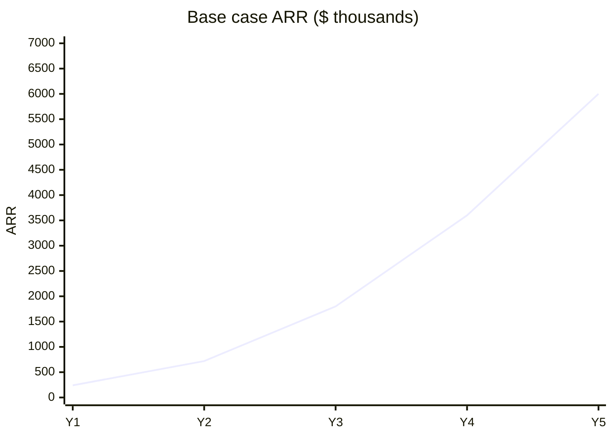

# Profitability, unit economics & charts

**Illustrative scenarios — not financial advice.** Replace assumptions with actuals quarterly.

## Pricing reference (product)

| Tier | Price (indicative) | Credits/mo |
|------|-------------------|------------|
| Community | $0 | 500 |
| Starter | $29 | 5,000 |
| Pro | $99 | 25,000 |
| Enterprise | Custom | 500,000+ |

## Unit economics (Pro customer example)

| Line | Monthly value |
|------|----------------|
| ARPU (Pro) | $99 |
| Est. infra + OpenAI COGS | $18–28 |
| Gross profit | ~$71–81 |
| Gross margin | ~72–82% |

## Five-year revenue scenarios (illustrative ARR)

Assumptions: blended ARPU grows with mix shift to Pro/Enterprise.

| Year | Conservative ARR | Base ARR | Aggressive ARR |
|------|------------------|----------|----------------|
| Y1 | $120k | $240k | $480k |
| Y2 | $350k | $720k | $1.4M |
| Y3 | $800k | $1.8M | $3.5M |
| Y4 | $1.5M | $3.6M | $7M |
| Y5 | $2.4M | $6M | $12M |

## Customer funnel (infographic logic)

| Stage | Rate (target) |
|-------|----------------|
| Landing → waitlist / signup | 8–12% |
| Signup → activated workflow | 35% |
| Activated → paid (90 days) | 12–18% |
| Paid → retained 12 mo | 85%+ |

## Cost structure at scale

| Category | Y1 | Y3 | Y5 |
|----------|----|----|-----|
| Engineering | 45% | 35% | 28% |
| Sales & marketing | 25% | 30% | 32% |
| G&A + legal | 15% | 12% | 10% |
| Infra & API | 15% | 18% | 15% |
| **Operating margin target** | negative | ~10% | **20–25%** |

## 50/50 partner distributions (example)

If Y3 base case **$1.8M ARR**, ~25% EBITDA → **$450k profit** → **$225k each** before personal tax (subject to reinvestment vote per doc 03).

## Dashboard KPIs to track

- MRR, ARR, net new MRR  
- Credit consumption vs tier  
- Self-heal success rate  
- Template-derived workflow %  
- CAC, LTV, payback period  

Update charts in partner PDF pack annually.
