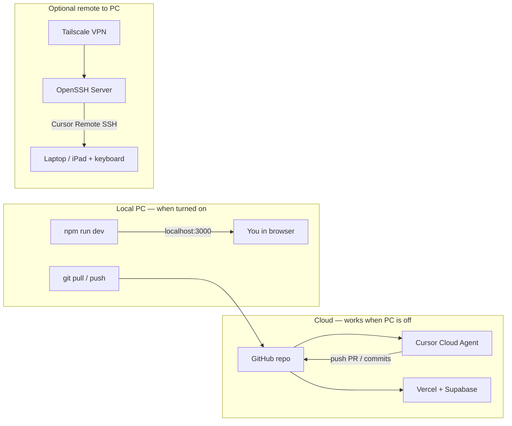

# Cloud, local PC, and remote access — complete guide

This document ties **Cursor Cloud Agents**, **GitHub**, **Vercel/Supabase**, and **optional Windows PC access** into one map. Everything here is **visible, reversible, and account-owned** — no hidden folders or covert tunnels.

**Related:** [resync-ai/DEPLOY-FROM-GITHUB.md](../resync-ai/DEPLOY-FROM-GITHUB.md) · [VERCEL-DEPLOY.md](../VERCEL-DEPLOY.md) · [RESYNC_AI_MASTER_DEPLOYMENT_BLUEPRINT.md](RESYNC_AI_MASTER_DEPLOYMENT_BLUEPRINT.md)

---

## How the pieces fit together



| Goal | Best path | PC must be on? |
|------|-----------|----------------|
| Ship code & fix bugs without a laptop | **Cursor Cloud Agent** + GitHub | No |
| Live SaaS for users | **Vercel** + **Supabase** | No |
| Edit & preview on your desk | `npm run dev` in `resync-ai/` | Yes |
| Edit files on home PC from elsewhere | **Tailscale** + **OpenSSH** + Cursor **Remote SSH** | Yes |
| Share one dev URL temporarily | **Cloudflare Tunnel** (manual start) | Yes, while tunnel runs |
| iPhone: view site / save files | **Vercel URL** or **GitHub ZIP** | No |

---

## Path 1 — Cloud-only (recommended default)

You do **not** need your Windows PC for most product work.

### 1.1 Cursor Cloud Agent

1. Open [cursor.com/agents](https://cursor.com/agents) (or Agents in Cursor).
2. Start an agent on this repo (`dna-digital-guide` / your fork).
3. The agent runs in a **cloud VM**, clones GitHub, edits, commits, pushes, and opens PRs.
4. Optional: link a **Cursor Environment** (see [.cursor/environment.json](../.cursor/environment.json)) so installs and `npm run dev` are preconfigured in the cloud pod.

**What the cloud agent can do:** change code, run tests, push branches, update PRs.  
**What it cannot do:** read arbitrary files on your home `C:\` unless those files are **in the repo** or you attach them to the chat.

### 1.2 GitHub as the single source of truth

```text
Cloud Agent ──push──► GitHub ◄──push── Local PC (when you work at desk)
                         │
                         ▼
                    Vercel auto-deploy (resync-ai root)
```

- Branch naming for agents: `cursor/<description>-61bc` (or your team convention).
- Merge to `main` → production deploy if Vercel is connected.

### 1.3 Production runtime (no PC)

Follow [resync-ai/DEPLOY-FROM-GITHUB.md](../resync-ai/DEPLOY-FROM-GITHUB.md):

- Vercel root directory: **`resync-ai`**
- Supabase migrations in `resync-ai/supabase/migrations/`
- Env vars from `resync-ai/.env.example`

Your **live app and database** live in the cloud; users never touch your PC.

---

## Path 2 — Local development (PC on)

```bash
cd resync-ai
cp .env.example .env.local
# fill keys
npm install
npm run dev
```

Open **http://localhost:3000**.  
Commit and push when done so Cloud Agents and Vercel stay in sync.

**Optional background dev server on Windows** (starts at login, logs to a normal folder):

```powershell
# Run once from repo root (Administrator for OpenSSH only if you choose Path 3)
.\scripts\windows\Register-ResyncDevAtLogon.ps1 -RepoPath "C:\path\to\dna-digital-guide"
```

Files and logs: `%USERPROFILE%\Documents\ResyncDev\` (not hidden). Remove via `Unregister-ResyncDevAtLogon.ps1`.

---

## Path 3 — Remote into your PC (Cursor without copying the whole disk)

Use this when you want **Cursor on another device** to open the project **on the Windows machine**.

### 3.1 Tailscale (private network)

1. Install [Tailscale](https://tailscale.com/download) on the PC and on the device you code from.
2. Sign in with the **same account** (or shared tailnet).
3. Note the PC’s Tailscale IP (e.g. `100.x.x.x`).

### 3.2 OpenSSH Server on Windows

1. **Settings → System → Optional features → Add OpenSSH Server**  
   Or run `.\scripts\windows\Install-ResyncDevRemote.ps1` (documents steps; can enable SSH).

2. Start and enable the service:

```powershell
Start-Service sshd
Set-Service -Name sshd -StartupType Automatic
```

3. Allow SSH in **Windows Firewall** (usually prompted automatically).

### 3.3 Cursor Remote SSH

1. On laptop: install Cursor → **Remote SSH** (same as VS Code flow).
2. Connect to `your-windows-user@100.x.x.x`.
3. Open folder: cloned repo path on the PC.

**Security:** only your Tailscale devices can reach SSH; do not port-forward SSH to the public internet without keys and hardening.

---

## Path 4 — On-demand tunnel (share localhost temporarily)

For demos or testing webhooks against **local** `npm run dev`:

1. Install [cloudflared](https://developers.cloudflare.com/cloudflare-one/connections/connect-networks/downloads/).
2. While dev server runs on port 3000:

```powershell
cloudflared tunnel --url http://localhost:3000
```

3. Use the printed `*.trycloudflare.com` URL until you stop the process.

**Not** for 24/7 hidden access — start when needed, stop when done. For production, use **Vercel**.

---

## Path 5 — Mobile / iPhone

| Need | Use |
|------|-----|
| Use the real product | Vercel production URL |
| Read docs & legal | GitHub Pages / `koder-pack` — [IPHONE-VIEW-AND-SAVE.md](../IPHONE-VIEW-AND-SAVE.md) |
| Save repo to Files | GitHub app → Download ZIP |
| Code with agent | Cursor Cloud Agent (no PC) |

---

## Cursor Cloud Environment (repo config)

The file [.cursor/environment.json](../.cursor/environment.json) tells Cursor how to **install dependencies and start the dev server** in cloud agent VMs. After you change it, trigger an **environment build** in Cursor Settings → Cloud → Environments (or ask a cloud agent to validate the build).

Typical flow:

1. Push `environment.json` to GitHub.
2. Build environment snapshot once.
3. New cloud agents boot faster with `resync-ai` ready to test.

---

## Sync checklist (cloud ↔ local)

| Step | Action |
|------|--------|
| Before local work | `git pull origin main` |
| After local work | `git add` → `commit` → `git push` |
| After cloud agent PR | Review PR → merge → Vercel deploys |
| Secrets | Only in Vercel / Supabase / `.env.local` — **never** commit `.env.local` |
| PC off | Cloud Agent + Vercel still work |

Optional helper (Windows):

```powershell
.\scripts\windows\Sync-ResyncRepo.ps1 -RepoPath "C:\path\to\dna-digital-guide"
```

---

## What we do **not** support in this repo

- Hidden files on `C:\` or “background lines” that bypass consent
- Always-on covert remote control
- Tunneling the entire disk outside your account

Those patterns are unsafe and are intentionally **not** scripted here.

---

## Quick decision tree

```text
Need to change code now?
├─ No PC handy → Cursor Cloud Agent (Path 1)
├─ PC on, at desk → npm run dev (Path 2)
└─ PC on, away from desk → Tailscale + SSH + Cursor Remote SSH (Path 3)

Need users to hit the app?
└─ Vercel + Supabase (Path 1.3) — PC optional

Need to show localhost to someone for 10 minutes?
└─ cloudflared (Path 4), then stop it
```

---

## Scripts (Windows)

| Script | Purpose |
|--------|---------|
| [scripts/windows/Install-ResyncDevRemote.ps1](../scripts/windows/Install-ResyncDevRemote.ps1) | Optional OpenSSH + folder layout under Documents |
| [scripts/windows/Register-ResyncDevAtLogon.ps1](../scripts/windows/Register-ResyncDevAtLogon.ps1) | Scheduled task: `npm run dev` at logon (visible name) |
| [scripts/windows/Unregister-ResyncDevAtLogon.ps1](../scripts/windows/Unregister-ResyncDevAtLogon.ps1) | Remove scheduled task |
| [scripts/windows/Sync-ResyncRepo.ps1](../scripts/windows/Sync-ResyncRepo.ps1) | `git pull` + optional `git push` |
| [scripts/windows/README.md](../scripts/windows/README.md) | Prerequisites and uninstall |

---

*Last updated: 2026-08-06 — aligns with Resync AI monorepo layout.*
